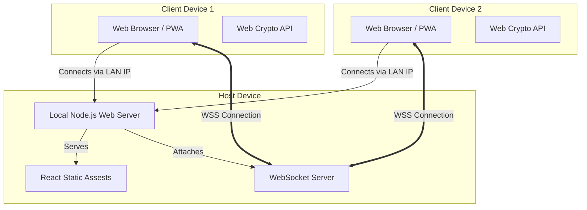

# High-Level Design (HLD)

## 1. System Architecture

The system utilizes a decentralized client-server model constrained to a Local Area Network (LAN). The device activating the mobile hotspot acts as the **Host Server**, running the backend infrastructure, while other devices on the network interact as **Clients**. 

## 2. Core Components

### 2.1 Backend Layer (The Host)
- **Node.js Web Server:** Responsible for fetching the React build output and serving the files over HTTP on port `8080` (or similar). It does NOT act as a database.
- **Socket.io Signaling Server:** Responsible for receiving encrypted message packets and broadcasting them to target clients. It holds a transient in-memory list of connected sockets and associated public identifiers to prevent message echoing and assist with connection tracking.
- **IP & QR Service:** A small utility on the host side that prints the WiFi gateway / LAN IP (e.g. `http://192.168.43.15:8080`) into the Host's terminal, generated as an ASCII QR code for fast scanning.

### 2.2 Frontend Layer (The Clients)
- **UI Render Engine:** Built with React to ensure state management is deterministic.
- **Avatar System:** An offline-capable module that randomly generates vector graphics (SVG) using user-seeded strings.
- **Crypto Engine:** A module wrapping browser-native `window.crypto.subtle` functions to handle asymmetric key generation, symmetric encryption, and decryption of payloads. 
- **Local Storage API:** Optionally caches the session ID and private key until the browser tab is explicitly closed or the session ends, allowing users to refresh the page without breaking the handshake.

## 3. Security Architecture (The E2EE Pipeline)
Since the main focus is security over raw, unencrypted, or potentially monitored Wi-Fi:

1. **Denial of Packet Sniffing:** Standard HTTP data over Wi-Fi can be sniffed using tools like Wireshark. Since SSL/HTTPS is difficult to implement on local dynamic IPs (without trusted certificates), we must encrypt data *before* it hits the WebSocket layer. 
2. **Key Exhange Phase:**
   - Every client generates a unique Public/Private key pair entirely on their device using `ECDH` (Curve P-256).
   - Upon entering the chatroom, a client broadcasts their Public Key via the Server.
   - Other clients acknowledge and mutually derive a **Shared Secret** using their own Private Key + the sender's Public Key.
3. **Data Transmission Phase:**
   - Messages typed in the frontend are symmetrically encrypted using `AES-GCM` using the derived Shared Secret.
   - An initialization vector (IV) is appended to the packet.
   - The ciphertext traverses the Wi-Fi. If sniffed, it looks like random binary noise.
   - The receiving client parses the IV, applies the Shared Secret, and decrypts the text locally.

## 4. Scalability Path
- **V1 (Current):** Web Application over LAN. Host runs code.
- **V2:** Package Host Node Server into a desktop executable (`.exe`/`.dmg`). Double click to start host. Clients still use web browsers.
- **V3:** React Native / Flutter apps that bundle both host and client logic. The app automatically detects if the user is a hotspot owner or a joiner, silently deploying the local server in the background using native background execution threads.
